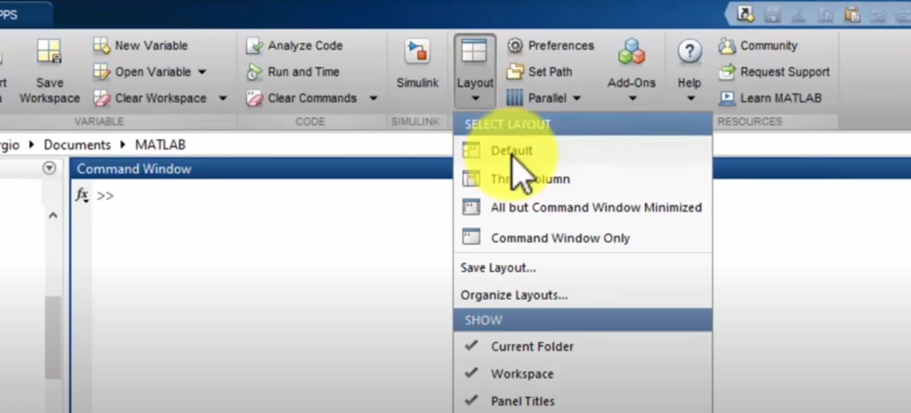
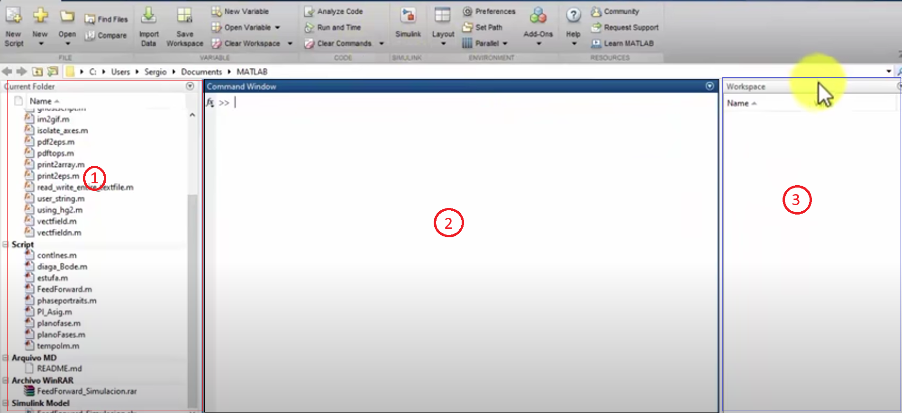

# Interfaz (2017)

## Barra de herramientas
Existen 3 barras:
1. HOME:
Vamos a trabajar más en HOME, podemos creas carpetas, scripts (donde podemos crear códigos), directorios, abrir Simulink.
2. PLOTS:
Aquí se encontrarán los modelos de gráficos que podemos usar.
3. APPS:
Todas las herramientas que podemos usar como algoritmos de optimizacikón que podemos llamar si se encuentran descargadas.

    

 

### HOME

Inicialmente en "Layout" en HOME podemos elegir como queremos que se vea nuestro espacio de trabajo.

    

Mayormente se usa el de tres columnas (three columns) porque aparecen:

|1. Current folder  (directorio actual)|2. Command Window  (ventana de comandos)|3. Workspace  (espacio de trabajo)|
|:-----------:|:-----------:|:-----------:|
|Aquí encontramos el directorio en el que estamos trabajando así como visualizar carpetas o archivos|Aquí colocaremos comandos que queramos ejecutar|Aquí se encuentran las diferentes variables que usaremos así como su valor y propiedades| 

    

Pero además existen más funciones en HOME
|Comando|Definición|
|:-----------:|:-----------:|
|New Script|Crea un espacio para poder codear y poder ejecutarlo cuando queramos, se diferencia del workspace porque podemos ejecutarlos cuando lo tengamos hecho o solo una parte del código.|
|New| 