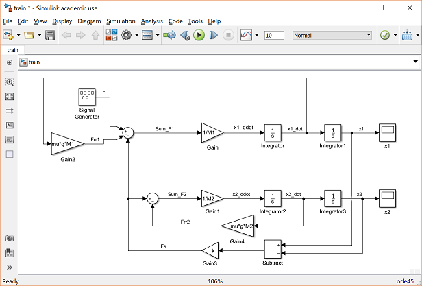

# MATLAB
Hola, aquí colocaré los aprendizajes sobre Matlab.
## Introducción
Matlab (MATrix LABoratory, "laboratorio de matrices"). Es un lenguaje de programación que ofrece un entorno de desarrollo integrado. 

NOs ayuda en la manipulación de matrices, representación de datos y funciones. Además que cuenta con simulink (plataforma de simulación multidominio) y GUIDE (editor de interfaces de usuario-GUI).

  

gaaaaaa